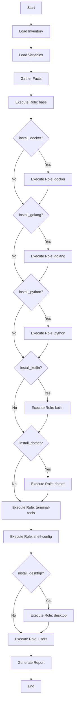

# Documento de Design

## Visão Geral

Este documento descreve o design da solução para preparar ambientes Linux recém-instalados como estações de desenvolvimento completas. A solução oferece duas abordagens: Shell Scripts (para instalações rápidas e únicas) e Ansible (para gerenciamento escalável de múltiplos hosts).

### Objetivos

- Automatizar completamente a configuração de ambientes de desenvolvimento
- Suportar múltiplas linguagens: Python, Golang, Kotlin, C#
- Fornecer terminais instrumentados com Oh-My-Bash e Oh-My-Zsh
- Instalar emuladores de terminal modernos (Terminator, Alacritty)
- Configurar fontes otimizadas (Powerline, Nerd Fonts)
- Substituir ferramentas padrão por alternativas modernas (eza, micro)
- Garantir idempotência completa
- Suportar múltiplos ambientes (Desktop, Raspberry Pi, Odroid, Cloud)

## Arquitetura

### Estrutura de Diretórios

```
linux-prepare/
├── scripts/
│   └── prepare.sh              # Script principal para desktops
├── rasp/
│   └── rasp4-prepare.sh        # Script para Raspberry Pi
├── odroid/
│   └── odroid-prepare.sh       # Script para Odroid
├── cloud/
│   ├── oci-ubuntu.sh           # Script para Oracle Cloud
│   ├── aws-ec2-prepare.sh      # Script para AWS EC2
│   ├── github-workspace.sh     # Script para GitHub Codespaces
│   └── killercoda.sh           # Script para Killercoda
├── ansible/
│   ├── README.md               # Documentação Ansible
│   ├── site.yml                # Playbook principal
│   ├── inventory/              # Inventários
│   ├── group_vars/             # Variáveis globais
│   ├── host_vars/              # Variáveis por host
│   ├── roles/                  # Roles organizadas
│   │   ├── base/               # Pacotes base e timezone
│   │   ├── docker/             # Docker e Docker Compose
│   │   ├── golang/             # Golang
│   │   ├── python/             # Python e pip
│   │   ├── kotlin/             # Kotlin via SDKMAN
│   │   ├── dotnet/             # .NET SDK
│   │   ├── terminal-tools/     # eza, micro, vim
│   │   ├── shell-config/       # Oh-My-Bash, Oh-My-Zsh
│   │   ├── desktop/            # VSCode, Chrome, fontes
│   │   └── users/              # Criação e configuração de usuários
│   └── playbooks/              # Playbooks específicos por ambiente
├── tests/
│   ├── docker/                 # Dockerfiles para testes
│   └── scripts/                # Scripts de validação
└── README.md                   # Documentação principal
```


### Abordagens de Implementação

#### Shell Scripts
- **Vantagens**: Execução rápida, sem dependências externas, ideal para instalações únicas
- **Uso**: Preparação de máquinas individuais, ambientes de desenvolvimento pessoal
- **Características**: Scripts bash standalone, execução direta com sudo

#### Ansible
- **Vantagens**: Declarativo, idempotente por design, escalável para múltiplos hosts
- **Uso**: Gerenciamento de frota de servidores, ambientes corporativos, CI/CD
- **Características**: Playbooks YAML, roles reutilizáveis, inventários dinâmicos

## Componentes e Interfaces

### 1. Sistema de Logging

#### Design
```bash
# Cores ANSI
CYAN="\033[36m"      # Início de operação
GREEN="\033[32m"     # Sucesso
RED="\033[31m"       # Erro
YELLOW="\033[33m"    # Aviso
GRAY="\033[90m"      # Skip/Info
RESET="\033[0m"      # Reset

# Símbolos
✓ - Sucesso
✗ - Erro
⚠ - Aviso
ℹ - Informação
⏭ - Skip
```

#### Funções de Log
```bash
log_info()    # Mensagem informativa em cyan com timestamp
log_success() # Mensagem de sucesso em verde
log_error()   # Mensagem de erro em vermelho
log_warning() # Mensagem de aviso em amarelo
log_skip()    # Mensagem de skip em cinza
```

#### Formato de Mensagem
```
[2024-11-15 14:30:45] ℹ Installing Docker...
[2024-11-15 14:31:02] ✓ Docker installed successfully
[2024-11-15 14:31:03] ⏭ Python already installed, skipping
```

### 2. Sistema de Detecção de Estado (Idempotência)

#### Verificações Implementadas
```bash
check_package_installed()    # Verifica se pacote está instalado
check_user_exists()          # Verifica se usuário existe
check_group_exists()         # Verifica se grupo existe
check_command_available()    # Verifica se comando está disponível
check_file_exists()          # Verifica se arquivo existe
check_alias_exists()         # Verifica se alias já está configurado
check_service_enabled()      # Verifica se serviço está habilitado
```

#### Fluxo de Verificação
```
1. Verificar estado atual
2. Se já configurado → Log skip e continuar
3. Se não configurado → Executar instalação/configuração
4. Validar resultado
5. Log sucesso ou erro
```


### 3. Sistema de Argumentos

#### Argumentos Disponíveis
```bash
-u=user1,user2    # Usuários para configurar (separados por vírgula)
--desktop         # Instalar componentes desktop (opt-in)
-h, --help        # Exibir ajuda
```

#### Argumentos de Skip (Exceções)
```bash
--skip-docker     # Pular instalação do Docker
--skip-go         # Pular instalação do Golang
--skip-python     # Pular instalação do Python
--skip-kotlin     # Pular instalação do Kotlin
--skip-jvm        # Pular instalação do JVM
--skip-dotnet     # Pular instalação do .NET
```

#### Lógica de Processamento
```bash
# Comportamento padrão: instala TODOS os componentes de desenvolvimento
# Desktop é opt-in: só instala se --desktop for fornecido
# --skip-* remove componentes específicos da instalação
# Exemplo: script sem argumentos instala Docker, Go, Python, Kotlin, JVM, .NET (sem desktop)
# Exemplo: script --skip-docker --skip-go instala Python, Kotlin, JVM, .NET (sem Docker e Go)
# Exemplo: script --desktop instala tudo incluindo componentes desktop
# Exemplo: script --desktop --skip-jvm instala tudo com desktop, exceto JVM
```

### 4. Instalação de Pacotes Base

#### Pacotes Essenciais
```bash
# Ferramentas de rede e download
wget curl telnet

# Controle de versão e desenvolvimento
git vim

# Shells e terminal
zsh

# Compressão e criptografia
zip unzip gpg

# Utilitários de sistema
jq htop btop fzf sudo

# Python
python3 python3-pip

# Ferramentas modernas
eza micro

# Bibliotecas
apt-transport-https zlib1g sqlite3
```

#### Processo de Instalação
```bash
1. apt update -y
2. Verificar cada pacote individualmente
3. Instalar apenas pacotes faltantes
4. apt install -y <pacotes>
5. Validar instalação de cada pacote
```


### 5. Configuração de Timezone

#### Implementação
```bash
# Método 1: Arquivo /etc/timezone
echo "America/Sao_Paulo" | sudo tee /etc/timezone

# Método 2: timedatectl (systemd)
sudo timedatectl set-timezone America/Sao_Paulo

# Método 3: Link simbólico
sudo ln -sf /usr/share/zoneinfo/America/Sao_Paulo /etc/localtime

# Validação
date  # Deve mostrar timezone correto
```

### 6. Gerenciamento de Usuários

#### Criação de Usuários
```bash
# Verificar se usuário existe
if ! id "$user" &>/dev/null; then
    # Criar usuário com prompt de senha
    sudo adduser --gecos "" $user
fi

# Adicionar ao grupo sudo
sudo usermod -aG sudo $user

# Adicionar ao grupo docker (se Docker instalado)
if [[ " ${args[@]} " =~ " -docker " ]]; then
    sudo usermod -aG docker $user
fi
```

#### Usuários Padrão Configurados
```bash
# Sempre configurados:
- root
- Usuário que executou o script (via sudo)
- Usuários especificados via -u=

# Exemplo:
# sudo ./prepare.sh -u=dev1,dev2 -all
# Configura: root, current_user, dev1, dev2
```

### 7. Instalação de Docker

#### Processo
```bash
# 1. Verificar se já instalado
if command -v docker &> /dev/null; then
    log_skip "Docker already installed"
    return
fi

# 2. Instalar via apt
sudo apt install -y docker.io docker-compose-v2

# 3. Criar grupo docker
if ! getent group docker > /dev/null; then
    sudo groupadd docker
fi

# 4. Adicionar usuários ao grupo
for user in "${users[@]}"; do
    sudo usermod -aG docker $user
done

# 5. Habilitar serviço
sudo systemctl enable docker
sudo systemctl start docker

# 6. Validar
docker --version
docker compose version
```


### 8. Instalação de Linguagens de Programação

#### Python
```bash
# Já instalado nos pacotes base
# Adicionar ferramentas adicionais
sudo apt install -y python3-venv python3-dev

# Configurar aliases
echo 'alias python=python3' >> ~/.bashrc
echo 'alias pip=pip3' >> ~/.bashrc
```

#### Golang
```bash
# 1. Download da versão mais recente
LATEST=$(curl https://go.dev/VERSION?m=text | head -n 1)
ARCH=$(dpkg --print-architecture)
wget "https://go.dev/dl/${LATEST}.linux-${ARCH}.tar.gz" -O golang.tar.gz

# 2. Extrair para /usr/local
sudo tar -C /usr/local -xzf golang.tar.gz
rm golang.tar.gz

# 3. Adicionar ao PATH
echo 'export PATH=$PATH:/usr/local/go/bin' | sudo tee -a /etc/profile
echo 'export PATH=$PATH:$HOME/go/bin' >> ~/.bashrc

# 4. Validar
go version
```

#### Kotlin (via SDKMAN)
```bash
# 1. Instalar SDKMAN se necessário
if [[ ! -f "$HOME/.sdkman/bin/sdkman-init.sh" ]]; then
    curl -s "https://get.sdkman.io" | bash
fi

# 2. Inicializar SDKMAN
source "$HOME/.sdkman/bin/sdkman-init.sh"

# 3. Instalar Kotlin
sdk install kotlin

# 4. Validar
kotlin -version
```

#### .NET
```bash
# 1. Adicionar repositório Microsoft
wget https://packages.microsoft.com/config/ubuntu/$(lsb_release -rs)/packages-microsoft-prod.deb
sudo dpkg -i packages-microsoft-prod.deb
rm packages-microsoft-prod.deb

# 2. Atualizar e instalar
sudo apt update
sudo apt install -y dotnet-sdk-8.0

# 3. Validar
dotnet --version
```

#### Java (via SDKMAN)
```bash
# Usar mesmo processo do Kotlin
source "$HOME/.sdkman/bin/sdkman-init.sh"
sdk install java

# Validar
java -version
```


### 9. Configuração de Shell e Terminal

#### Oh-My-Zsh
```bash
# 1. Instalar Oh-My-Zsh
if [ ! -d "$HOME/.oh-my-zsh" ]; then
    sh -c "$(curl -fsSL https://raw.githubusercontent.com/ohmyzsh/ohmyzsh/master/tools/install.sh)"
fi

# 2. Configurar tema
sed -i 's/^ZSH_THEME=.*/ZSH_THEME="frisk"/' "$HOME/.zshrc"

# 3. Configurar plugins
PLUGINS="git colorize command-not-found compleat composer cp debian dircycle docker docker-compose dotnet eza fzf gh golang grc nats pip postgres procs python qrcode redis-cli repo rust sdk ssh sudo systemd themes ubuntu vscode zsh-interactive-cd"
sed -i "s/^plugins=.*/plugins=($PLUGINS)/" "$HOME/.zshrc"

# 4. Adicionar aliases
echo 'alias ls="eza -hHbmgalT -L 1 --time-style=long-iso --icons"' >> ~/.zshrc
echo 'alias lt="eza -hHbmgalT -L 4 --time-style=long-iso --icons"' >> ~/.zshrc

# 5. Configurar variáveis de ambiente
echo 'export EDITOR=micro' >> ~/.zshrc
echo 'export VISUAL=micro' >> ~/.zshrc

# 6. Alterar shell padrão
sudo chsh -s /usr/bin/zsh $user
```

#### Oh-My-Bash
```bash
# 1. Instalar Oh-My-Bash
if [ ! -d "$HOME/.oh-my-bash" ]; then
    curl -fsSL https://raw.githubusercontent.com/ohmybash/oh-my-bash/master/tools/install.sh | bash
fi

# 2. Adicionar aliases
echo 'alias ls="eza -hHbmgalT -L 1 --time-style=long-iso --icons"' >> ~/.bashrc
echo 'alias lt="eza -hHbmgalT -L 4 --time-style=long-iso --icons"' >> ~/.bashrc

# 3. Configurar variáveis de ambiente
echo 'export EDITOR=micro' >> ~/.bashrc
echo 'export VISUAL=micro' >> ~/.bashrc
```

#### Vim
```bash
# 1. Clonar configuração awesome vimrc
if [ ! -d "$HOME/.vim_runtime" ]; then
    git clone --depth=1 https://github.com/amix/vimrc.git ~/.vim_runtime
fi

# 2. Instalar
sh ~/.vim_runtime/install_awesome_vimrc.sh

# 3. Configurar line numbers
echo 'set nu' >> ~/.vim_runtime/my_configs.vim
```


### 10. Componentes Desktop

#### Fontes
```bash
# 1. Powerline Fonts
if [ ! -d "$HOME/fonts" ]; then
    git clone --depth=1 https://github.com/powerline/fonts.git ~/fonts
    cd ~/fonts && ./install.sh
fi

# 2. Nerd Fonts (selecionadas)
if [ ! -d "$HOME/nerd-fonts" ]; then
    git clone --depth=1 https://github.com/ryanoasis/nerd-fonts.git ~/nerd-fonts
    cd ~/nerd-fonts
    ./install.sh FiraCode JetBrainsMono Hack
fi

# 3. MS Core Fonts
sudo apt install -y ttf-mscorefonts-installer

# 4. Atualizar cache de fontes
fc-cache -fv
```

#### Emuladores de Terminal
```bash
# 1. Instalar Terminator e Alacritty
sudo apt install -y terminator alacritty

# 2. Configurar Terminator
mkdir -p ~/.config/terminator
cat > ~/.config/terminator/config << 'EOF'
[global_config]
  title_hide_sizetext = True
[profiles]
  [[default]]
    background_darkness = 0.9
    background_type = transparent
    font = FiraCode Nerd Font Mono 11
    use_system_font = False
EOF

# 3. Configurar Alacritty
mkdir -p ~/.config/alacritty
cat > ~/.config/alacritty/alacritty.yml << 'EOF'
font:
  normal:
    family: FiraCode Nerd Font
    style: Regular
  size: 11.0
window:
  opacity: 0.9
EOF
```

#### Aplicações
```bash
# 1. VSCode
sudo snap install code --classic

# 2. Google Chrome
wget https://dl.google.com/linux/direct/google-chrome-stable_current_amd64.deb
sudo dpkg -i google-chrome-stable_current_amd64.deb
sudo apt install -f -y
rm google-chrome-stable_current_amd64.deb
```


### 11. Scripts Específicos por Ambiente

#### Raspberry Pi (rasp/rasp4-prepare.sh)
```bash
# Diferenças:
- Detectar arquitetura ARM
- Usar pacotes ARM quando disponível
- Pular componentes desktop por padrão
- Otimizações para hardware limitado
- Configurações específicas de GPIO (opcional)
```

#### Odroid (odroid/odroid-prepare.sh)
```bash
# Diferenças:
- Detectar arquitetura ARM
- Configurações específicas de Odroid
- Pular componentes desktop por padrão
- Otimizações de performance
```

#### Oracle Cloud (cloud/oci-ubuntu.sh)
```bash
# Diferenças:
- Configurar firewall (iptables)
sudo iptables -P INPUT ACCEPT
sudo iptables -P OUTPUT ACCEPT
sudo iptables -P FORWARD ACCEPT
sudo iptables -F

- Pular componentes desktop
- Configurações de rede cloud
- Otimizações para VM
```

#### AWS EC2 (cloud/aws-ec2-prepare.sh)
```bash
# Diferenças:
- Usar yum ao invés de apt (Amazon Linux)
- Configurar usuário ec2-user
- Pular componentes desktop
- Configurações específicas de AWS
- Security groups via AWS CLI (opcional)
```

#### GitHub Codespaces (cloud/github-workspace.sh)
```bash
# Diferenças:
- Preservar configurações existentes do Codespaces
- Pular componentes desktop
- Configurações otimizadas para desenvolvimento remoto
- Integração com GitHub CLI
```

#### Killercoda (cloud/killercoda.sh)
```bash
# Diferenças:
- Executável via curl direto da URL
- Instalação mínima e rápida
- Pular componentes desktop
- Configuração para ambiente de aprendizado
- Exemplo de execução:
curl https://raw.githubusercontent.com/USER/REPO/main/cloud/killercoda.sh | bash
```


## Implementação Ansible

### Estrutura de Roles

#### Role: base
```yaml
# Responsabilidades:
- Configurar timezone (America/Sao_Paulo)
- Instalar pacotes essenciais
- Configurar repositórios apt
- Atualizar sistema

# Tarefas principais:
- Set timezone
- Update apt cache
- Install base packages
- Configure locale
```

#### Role: docker
```yaml
# Responsabilidades:
- Instalar Docker e Docker Compose v2
- Criar grupo docker
- Adicionar usuários ao grupo
- Habilitar serviço

# Tarefas principais:
- Install docker.io
- Install docker-compose-v2
- Create docker group
- Add users to docker group
- Enable docker service
```

#### Role: golang
```yaml
# Responsabilidades:
- Download e instalação do Golang
- Configurar PATH
- Validar instalação

# Tarefas principais:
- Get latest Go version
- Download Go tarball
- Extract to /usr/local
- Configure PATH in /etc/profile
```

#### Role: python
```yaml
# Responsabilidades:
- Instalar Python 3 e pip
- Instalar virtualenv
- Configurar aliases

# Tarefas principais:
- Install python3 and python3-pip
- Install python3-venv
- Configure python aliases
```

#### Role: kotlin
```yaml
# Responsabilidades:
- Instalar SDKMAN
- Instalar Kotlin via SDKMAN
- Validar instalação

# Tarefas principais:
- Install SDKMAN
- Install Kotlin
- Validate installation
```

#### Role: dotnet
```yaml
# Responsabilidades:
- Adicionar repositório Microsoft
- Instalar .NET SDK
- Validar instalação

# Tarefas principais:
- Add Microsoft repository
- Install dotnet-sdk-8.0
- Validate installation
```


#### Role: terminal-tools
```yaml
# Responsabilidades:
- Instalar eza, micro, vim
- Configurar vim com awesome vimrc
- Validar instalações

# Tarefas principais:
- Install eza
- Install micro
- Clone and install awesome vimrc
- Configure vim settings
```

#### Role: shell-config
```yaml
# Responsabilidades:
- Instalar Oh-My-Zsh e Oh-My-Bash
- Configurar temas e plugins
- Adicionar aliases
- Configurar variáveis de ambiente
- Alterar shell padrão para zsh

# Tarefas principais:
- Install Oh-My-Zsh
- Configure zsh theme (frisk)
- Configure zsh plugins
- Install Oh-My-Bash
- Add eza aliases
- Set EDITOR and VISUAL
- Change default shell to zsh
```

#### Role: desktop
```yaml
# Responsabilidades:
- Instalar fontes (Powerline, Nerd Fonts)
- Instalar emuladores de terminal
- Instalar VSCode e Chrome
- Configurar emuladores

# Tarefas principais:
- Clone and install Powerline fonts
- Clone and install Nerd Fonts
- Install MS Core Fonts
- Install Terminator and Alacritty
- Configure Terminator
- Configure Alacritty
- Install VSCode
- Install Google Chrome
```

#### Role: users
```yaml
# Responsabilidades:
- Criar usuários
- Adicionar ao grupo sudo
- Adicionar ao grupo docker
- Aplicar configurações de shell

# Tarefas principais:
- Create users
- Add to sudo group
- Add to docker group
- Apply shell configurations
```


### Playbook Principal (site.yml)

```yaml
---
- name: Prepare Linux Development Environment
  hosts: all
  become: yes
  
  vars_files:
    - group_vars/all.yml
  
  roles:
    - role: base
      tags: ['base', 'always']
    
    - role: docker
      when: install_docker | default(true)
      tags: ['docker']
    
    - role: golang
      when: install_golang | default(true)
      tags: ['golang', 'go']
    
    - role: python
      when: install_python | default(true)
      tags: ['python']
    
    - role: kotlin
      when: install_kotlin | default(true)
      tags: ['kotlin']
    
    - role: dotnet
      when: install_dotnet | default(true)
      tags: ['dotnet']
    
    - role: terminal-tools
      tags: ['terminal', 'tools']
    
    - role: shell-config
      tags: ['shell', 'zsh', 'bash']
    
    - role: desktop
      when: install_desktop | default(false)
      tags: ['desktop', 'never']
    
    - role: users
      tags: ['users']
```

### Variáveis (group_vars/all.yml)

```yaml
---
# Timezone
timezone: America/Sao_Paulo

# Componentes a instalar (padrão: true)
install_docker: true
install_golang: true
install_python: true
install_kotlin: true
install_dotnet: true
install_desktop: false

# Usuários a configurar
dev_users:
  - username: developer
    groups: ['sudo', 'docker']
  - username: devops
    groups: ['sudo', 'docker']

# Configurações de shell
zsh_theme: frisk
zsh_plugins:
  - git
  - colorize
  - command-not-found
  - docker
  - docker-compose
  - dotnet
  - eza
  - fzf
  - golang
  - python
  - vscode

# Aliases
shell_aliases:
  - { alias: 'ls', command: 'eza -hHbmgalT -L 1 --time-style=long-iso --icons' }
  - { alias: 'lt', command: 'eza -hHbmgalT -L 4 --time-style=long-iso --icons' }

# Variáveis de ambiente
shell_env_vars:
  - { name: 'EDITOR', value: 'micro' }
  - { name: 'VISUAL', value: 'micro' }
```


### Playbooks Específicos por Ambiente

#### Desktop (playbooks/desktop.yml)
```yaml
---
- name: Prepare Desktop Development Environment
  hosts: desktops
  become: yes
  
  vars:
    install_desktop: true
  
  roles:
    - base
    - docker
    - golang
    - python
    - kotlin
    - dotnet
    - terminal-tools
    - shell-config
    - desktop
    - users
```

#### Server (playbooks/server.yml)
```yaml
---
- name: Prepare Server Development Environment
  hosts: servers
  become: yes
  
  vars:
    install_desktop: false
  
  roles:
    - base
    - docker
    - golang
    - python
    - kotlin
    - dotnet
    - terminal-tools
    - shell-config
    - users
```

#### Raspberry Pi (playbooks/raspberry.yml)
```yaml
---
- name: Prepare Raspberry Pi Development Environment
  hosts: raspberry
  become: yes
  
  vars:
    install_desktop: false
    arch: arm64
  
  roles:
    - base
    - docker
    - golang
    - python
    - terminal-tools
    - shell-config
    - users
```

#### Cloud (playbooks/cloud.yml)
```yaml
---
- name: Prepare Cloud Development Environment
  hosts: cloud
  become: yes
  
  vars:
    install_desktop: false
    configure_firewall: true
  
  roles:
    - base
    - docker
    - golang
    - python
    - kotlin
    - dotnet
    - terminal-tools
    - shell-config
    - users
```


## Estratégia de Testes

### Testes com Docker

#### Dockerfile para Ubuntu
```dockerfile
FROM ubuntu:22.04

ENV DEBIAN_FRONTEND=noninteractive

# Copiar script
COPY scripts/prepare.sh /tmp/prepare.sh

# Executar script
RUN chmod +x /tmp/prepare.sh && \
    /tmp/prepare.sh -u=testuser --skip-desktop -all

# Validar instalações
RUN command -v docker && \
    command -v go && \
    command -v python3 && \
    command -v dotnet && \
    command -v zsh && \
    command -v micro && \
    command -v eza

CMD ["/bin/zsh"]
```

#### Dockerfile para Debian
```dockerfile
FROM debian:12

ENV DEBIAN_FRONTEND=noninteractive

# Copiar script
COPY scripts/prepare.sh /tmp/prepare.sh

# Executar script
RUN chmod +x /tmp/prepare.sh && \
    /tmp/prepare.sh -u=testuser --skip-desktop -all

# Validar instalações
RUN command -v docker && \
    command -v go && \
    command -v python3 && \
    command -v dotnet && \
    command -v zsh && \
    command -v micro && \
    command -v eza

CMD ["/bin/zsh"]
```

### Scripts de Validação

#### validate.sh
```bash
#!/bin/bash

# Cores para output
GREEN="\033[32m"
RED="\033[31m"
RESET="\033[0m"

validate_command() {
    local cmd=$1
    if command -v $cmd &> /dev/null; then
        echo -e "${GREEN}✓${RESET} $cmd is installed"
        return 0
    else
        echo -e "${RED}✗${RESET} $cmd is NOT installed"
        return 1
    fi
}

validate_user() {
    local user=$1
    if id "$user" &>/dev/null; then
        echo -e "${GREEN}✓${RESET} User $user exists"
        return 0
    else
        echo -e "${RED}✗${RESET} User $user does NOT exist"
        return 1
    fi
}

validate_alias() {
    local alias_name=$1
    local shell_rc=$2
    if grep -q "alias $alias_name=" "$shell_rc"; then
        echo -e "${GREEN}✓${RESET} Alias $alias_name configured in $shell_rc"
        return 0
    else
        echo -e "${RED}✗${RESET} Alias $alias_name NOT configured in $shell_rc"
        return 1
    fi
}

# Validar comandos
validate_command docker
validate_command go
validate_command python3
validate_command dotnet
validate_command kotlin
validate_command zsh
validate_command micro
validate_command eza

# Validar usuários
validate_user testuser

# Validar aliases
validate_alias ls ~/.zshrc
validate_alias lt ~/.zshrc

# Validar variáveis de ambiente
if grep -q "EDITOR=micro" ~/.zshrc; then
    echo -e "${GREEN}✓${RESET} EDITOR configured"
else
    echo -e "${RED}✗${RESET} EDITOR NOT configured"
fi
```


### CI/CD Pipeline

#### GitHub Actions Workflow
```yaml
name: Test Scripts

on:
  push:
    branches: [ main, develop ]
  pull_request:
    branches: [ main ]

jobs:
  test-ubuntu:
    runs-on: ubuntu-latest
    strategy:
      matrix:
        version: ['20.04', '22.04', '24.04']
    
    steps:
      - uses: actions/checkout@v3
      
      - name: Build Docker image
        run: |
          docker build -f tests/docker/Dockerfile.ubuntu-${{ matrix.version }} \
            -t test-ubuntu-${{ matrix.version }} .
      
      - name: Run validation
        run: |
          docker run test-ubuntu-${{ matrix.version }} /tests/scripts/validate.sh
  
  test-debian:
    runs-on: ubuntu-latest
    strategy:
      matrix:
        version: ['11', '12']
    
    steps:
      - uses: actions/checkout@v3
      
      - name: Build Docker image
        run: |
          docker build -f tests/docker/Dockerfile.debian-${{ matrix.version }} \
            -t test-debian-${{ matrix.version }} .
      
      - name: Run validation
        run: |
          docker run test-debian-${{ matrix.version }} /tests/scripts/validate.sh
  
  test-idempotence:
    runs-on: ubuntu-latest
    
    steps:
      - uses: actions/checkout@v3
      
      - name: Run script twice
        run: |
          docker build -f tests/docker/Dockerfile.ubuntu-22.04 -t test-idempotence .
          docker run test-idempotence bash -c "
            /tmp/prepare.sh -u=testuser --skip-desktop -all && \
            /tmp/prepare.sh -u=testuser --skip-desktop -all
          "
```

## Tratamento de Erros

### Estratégias

#### 1. Verificação Prévia
```bash
# Verificar se comando existe antes de usar
if ! command -v apt &> /dev/null; then
    log_error "apt not found. This script requires Debian-based distribution."
    exit 1
fi

# Verificar se é root ou tem sudo
if [ "$EUID" -ne 0 ]; then
    if ! command -v sudo &> /dev/null; then
        log_error "This script must be run as root or with sudo."
        exit 1
    fi
fi
```

#### 2. Tratamento de Falhas
```bash
# Usar set -e para parar em erros
set -euo pipefail

# Ou tratar individualmente
if ! apt install -y package; then
    log_error "Failed to install package"
    # Tentar alternativa ou continuar
fi
```

#### 3. Rollback (quando possível)
```bash
# Backup antes de modificar
if [ -f ~/.zshrc ]; then
    cp ~/.zshrc ~/.zshrc.backup.$(date +%Y%m%d_%H%M%S)
fi
```

#### 4. Logs Detalhados
```bash
# Redirecionar stderr para log
exec 2> >(tee -a /var/log/prepare-script.log)

# Log de cada operação
log_info "Starting installation of Docker..."
if install_docker; then
    log_success "Docker installed successfully"
else
    log_error "Failed to install Docker. Check /var/log/prepare-script.log"
fi
```


## Modelos de Dados

### Estrutura de Configuração de Usuário

```bash
# Array de usuários
users=(
    "root"
    "$(whoami)"
    "user1"
    "user2"
)

# Informações por usuário
user_info=(
    [username]="developer"
    [home_dir]="/home/developer"
    [shell]="/usr/bin/zsh"
    [groups]="sudo,docker"
)
```

### Estado de Instalação

```bash
# Tracking de componentes instalados
declare -A installed_components=(
    [docker]=false
    [golang]=false
    [python]=false
    [kotlin]=false
    [dotnet]=false
    [zsh]=false
    [ohmyzsh]=false
    [ohmybash]=false
    [vim]=false
    [micro]=false
    [eza]=false
)

# Atualizar estado
installed_components[docker]=true
```

### Configuração de Argumentos

```bash
# Estrutura de argumentos
declare -A config=(
    [install_docker]=true
    [install_go]=true
    [install_python]=true
    [install_kotlin]=true
    [install_jvm]=true
    [install_dotnet]=true
    [install_desktop]=false
    [users]="root,developer"
)

# Processar --skip-*
if [[ " ${args[@]} " =~ " --skip-docker " ]]; then
    config[install_docker]=false
fi
```

## Documentação

### README.md Principal

#### Estrutura
```markdown
# Linux Development Environment Setup

## Overview
Brief description of the project

## Features
- Multi-language support (Python, Go, Kotlin, C#)
- Modern terminal tools (eza, micro, zsh)
- Docker and containerization
- Desktop applications (optional)
- Multiple environment support

## Quick Start
### Desktop Installation
### Server Installation
### Cloud Installation

## Supported Environments
- Ubuntu Desktop (20.04, 22.04, 24.04)
- Debian (11, 12)
- Raspberry Pi (Ubuntu)
- Odroid (Ubuntu)
- Oracle Cloud Infrastructure
- AWS EC2 (Amazon Linux)
- GitHub Codespaces
- Killercoda

## Usage
### Shell Scripts
### Ansible

## Arguments Reference
### Installation Arguments
### Skip Arguments

## Examples
### Example 1: Full Desktop Setup
### Example 2: Server with Docker and Go
### Example 3: Multiple Users

## Comparison: Shell Scripts vs Ansible

## Testing

## Troubleshooting

## Contributing

## License
```


### ansible/README.md

#### Estrutura
```markdown
# Ansible Implementation

## Prerequisites
- Ansible 2.9+
- Python 3.8+
- SSH access to target hosts

## Installation on Fresh OS

### Ubuntu/Debian
```bash
sudo apt update
sudo apt install -y ansible python3-pip
```

### Verify Installation
```bash
ansible --version
```

## Directory Structure
```
ansible/
├── site.yml              # Main playbook
├── inventory/            # Host inventories
├── group_vars/           # Group variables
├── host_vars/            # Host-specific variables
├── roles/                # Ansible roles
└── playbooks/            # Specific playbooks
```

## Quick Start

### Single Host
```bash
ansible-playbook -i "localhost," -c local site.yml
```

### Multiple Hosts
```bash
ansible-playbook -i inventory/production site.yml
```

## Customization

### Variables
Edit `group_vars/all.yml` to customize:
- Timezone
- Components to install
- Users to create
- Shell configurations

### Selective Execution
Use tags to run specific roles:
```bash
ansible-playbook site.yml --tags "docker,golang"
```

Skip specific roles:
```bash
ansible-playbook site.yml --skip-tags "desktop"
```

## Examples

### Desktop Setup
### Server Setup
### Cloud Setup

## Inventory Examples

### Single Host
### Multiple Hosts
### Dynamic Inventory

## Dry Run
```bash
ansible-playbook site.yml --check --diff
```

## Troubleshooting

### Common Issues
### Debug Mode
### Logs

## Advanced Usage

### Vault for Secrets
### Custom Roles
### Integration with CI/CD
```


## Considerações de Performance

### Otimizações

#### 1. Instalação Paralela
```bash
# Instalar pacotes em lote ao invés de um por um
apt install -y package1 package2 package3

# Usar background jobs para operações independentes
install_docker &
install_golang &
wait
```

#### 2. Cache de Downloads
```bash
# Reutilizar downloads quando possível
CACHE_DIR="/tmp/prepare-cache"
mkdir -p $CACHE_DIR

if [ -f "$CACHE_DIR/golang.tar.gz" ]; then
    log_skip "Using cached Golang tarball"
else
    wget -O "$CACHE_DIR/golang.tar.gz" $GOLANG_URL
fi
```

#### 3. Verificações Rápidas
```bash
# Usar verificações rápidas antes de operações pesadas
if command -v docker &> /dev/null; then
    return 0  # Skip installation
fi
```

#### 4. Ansible Optimizations
```yaml
# Usar facts caching
gathering = smart
fact_caching = jsonfile
fact_caching_connection = /tmp/ansible_facts
fact_caching_timeout = 86400

# Usar pipelining
pipelining = True

# Paralelizar execução
forks = 10
```

## Considerações de Segurança

### Práticas Implementadas

#### 1. Validação de Downloads
```bash
# Verificar checksums quando disponível
wget $URL -O file.tar.gz
echo "$EXPECTED_SHA256 file.tar.gz" | sha256sum -c -
```

#### 2. Uso de HTTPS
```bash
# Sempre usar HTTPS para downloads
wget https://example.com/file
curl -fsSL https://example.com/script.sh
```

#### 3. Verificação de Assinaturas
```bash
# Verificar assinaturas GPG quando disponível
wget $URL.asc
gpg --verify file.asc file
```

#### 4. Permissões Adequadas
```bash
# Configurar permissões corretas
chmod 600 ~/.ssh/config
chmod 700 ~/.ssh
chown $user:$user ~/.zshrc
```

#### 5. Sudo Seguro
```bash
# Evitar sudo desnecessário
run_as() {
    local user=$1
    shift
    sudo -u "$user" bash -c "$*"
}
```


## Fluxo de Execução

### Shell Script Flow

```mermaid
graph TD
    A[Start] --> B{Check Root/Sudo}
    B -->|No| C[Request Sudo]
    B -->|Yes| D[Parse Arguments]
    C --> D
    D --> E[Set Default Users]
    E --> F[Configure Timezone]
    F --> G[Install Base Packages]
    G --> H{Install Docker?}
    H -->|Yes| I[Install Docker]
    H -->|No| J{Install Go?}
    I --> J
    J -->|Yes| K[Install Golang]
    J -->|No| L{Install Python?}
    K --> L
    L -->|Yes| M[Install Python]
    L -->|No| N{Install Kotlin?}
    M --> N
    N -->|Yes| O[Install Kotlin]
    N -->|No| P{Install JVM?}
    O --> P
    P -->|Yes| Q[Install JVM]
    P -->|No| R{Install .NET?}
    Q --> R
    R -->|Yes| S[Install .NET]
    R -->|No| T[For Each User]
    S --> T
    T --> U[Install User Env]
    U --> V[Install Oh-My-Bash]
    V --> W[Install Oh-My-Zsh]
    W --> X[Configure Aliases]
    X --> Y[Set Default Shell]
    Y --> Z{Install Desktop?}
    Z -->|Yes| AA[Install Desktop Components]
    Z -->|No| AB{More Users?}
    AA --> AB
    AB -->|Yes| T
    AB -->|No| AC[Cleanup]
    AC --> AD[Display Summary]
    AD --> AE[End]
```



### Ansible Execution Flow




## Decisões de Design

### 1. Shell Scripts vs Ansible

**Decisão**: Implementar ambas as abordagens

**Razão**:
- Shell scripts são mais simples para casos de uso únicos
- Ansible é melhor para gerenciamento de múltiplos hosts
- Usuários podem escolher a ferramenta mais apropriada

### 2. Zsh como Shell Padrão

**Decisão**: Configurar Zsh como shell padrão para todos os usuários

**Razão**:
- Zsh oferece melhor experiência de usuário
- Oh-My-Zsh fornece plugins e temas robustos
- Mantém Bash configurado como fallback

### 3. Eza ao invés de ls

**Decisão**: Substituir ls por eza via aliases

**Razão**:
- Eza oferece melhor visualização
- Suporte a ícones e cores
- Mantém compatibilidade via aliases

### 4. Micro como Editor Padrão

**Decisão**: Configurar micro como EDITOR e VISUAL

**Razão**:
- Interface intuitiva para novos usuários
- Atalhos familiares (Ctrl+C, Ctrl+V)
- Mantém vim instalado para usuários avançados

### 5. Instalação via apt

**Decisão**: Priorizar instalação via apt quando possível

**Razão**:
- Gerenciamento centralizado de pacotes
- Atualizações automáticas via apt upgrade
- Melhor integração com o sistema

### 6. Timezone Fixo (America/Sao_Paulo)

**Decisão**: Configurar timezone fixo ao invés de parametrizável

**Razão**:
- Requisito específico do projeto
- Pode ser facilmente modificado no código se necessário
- Simplifica a interface de argumentos

### 7. Estrutura de Diretórios por Ambiente

**Decisão**: Separar scripts por ambiente (scripts/, rasp/, odroid/, cloud/)

**Razão**:
- Organização clara
- Facilita manutenção
- Permite otimizações específicas por ambiente

### 8. Idempotência Explícita

**Decisão**: Implementar verificações explícitas de estado

**Razão**:
- Shell scripts não são idempotentes por padrão
- Permite execuções múltiplas sem erros
- Melhora experiência do usuário

### 9. Logs em Inglês

**Decisão**: Todas as mensagens de log em inglês (EN-US)

**Razão**:
- Padrão internacional
- Facilita troubleshooting com comunidade
- Melhor para ambientes corporativos

### 10. Testes via Docker

**Decisão**: Usar Docker para testes automatizados

**Razão**:
- Ambientes isolados e reproduzíveis
- Rápido para executar
- Não requer VMs ou hardware físico


## Limitações e Restrições

### Distribuições Suportadas

**Limitação**: Apenas distribuições baseadas em Debian

**Razão**:
- Foco em Ubuntu e Debian (mais comuns)
- Exceção: AWS EC2 com Amazon Linux (usa yum)
- Simplifica manutenção e testes

**Impacto**:
- Não funciona em Fedora, CentOS, Arch Linux
- Mensagem de erro clara quando detectado

### Arquiteturas

**Limitação**: Suporte principal para x86_64 e ARM64

**Razão**:
- Cobrem 99% dos casos de uso
- Raspberry Pi e Odroid usam ARM64

**Impacto**:
- Pode não funcionar em arquiteturas exóticas
- Verificação de arquitetura implementada

### Componentes Desktop

**Limitação**: Não testável via Docker

**Razão**:
- Containers não têm interface gráfica
- Requer ambiente desktop real

**Impacto**:
- Testes de desktop devem ser manuais
- CI/CD testa apenas componentes não-desktop

### Dependências de Rede

**Limitação**: Requer conexão com internet

**Razão**:
- Downloads de pacotes, fontes, scripts
- Instalação de ferramentas via curl/wget

**Impacto**:
- Não funciona offline
- Pode falhar em redes restritas

### Permissões

**Limitação**: Requer privilégios de root/sudo

**Razão**:
- Instalação de pacotes do sistema
- Modificação de configurações globais
- Criação de usuários

**Impacto**:
- Não pode ser executado por usuário comum
- Verificação implementada no início

## Extensibilidade

### Adicionando Novas Linguagens

```bash
# 1. Criar função de instalação
install_rust() {
    log_info "Installing Rust..."
    
    if command -v rustc &> /dev/null; then
        log_skip "Rust already installed"
        return 0
    fi
    
    curl --proto '=https' --tlsv1.2 -sSf https://sh.rustup.rs | sh -s -- -y
    source "$HOME/.cargo/env"
    
    if command -v rustc &> /dev/null; then
        log_success "Rust installed successfully"
    else
        log_error "Failed to install Rust"
        return 1
    fi
}

# 2. Adicionar argumento
# -rust | --skip-rust

# 3. Adicionar ao processamento
if [[ " ${args[@]} " =~ " -rust " ]]; then
    install_rust
fi

# 4. Adicionar ao help
echo " | -rust      | Instala o Rust e Cargo.                                                                     |"
```

### Adicionando Nova Role Ansible

```yaml
# 1. Criar estrutura
ansible/roles/rust/
├── tasks/
│   └── main.yml
├── defaults/
│   └── main.yml
└── handlers/
    └── main.yml

# 2. Implementar tasks
---
- name: Check if Rust is installed
  command: rustc --version
  register: rust_check
  ignore_errors: yes

- name: Install Rust
  shell: curl --proto '=https' --tlsv1.2 -sSf https://sh.rustup.rs | sh -s -- -y
  when: rust_check.rc != 0

# 3. Adicionar ao site.yml
- role: rust
  when: install_rust | default(true)
  tags: ['rust']
```


### Adicionando Novo Ambiente

```bash
# 1. Criar script específico
# Exemplo: cloud/azure-vm.sh

#!/bin/bash
# Azure VM specific configurations

# Source common functions (se houver)
source ../scripts/common.sh

# Azure-specific settings
configure_azure_network() {
    # Configure Azure networking
    log_info "Configuring Azure network settings..."
}

# Main execution
install_base
configure_azure_network

# Skip desktop for cloud
install_docker
install_golang
# ... outros componentes

# 2. Adicionar documentação no README.md
### Azure VM
```bash
curl https://raw.githubusercontent.com/USER/REPO/main/cloud/azure-vm.sh | bash
```

# 3. Adicionar playbook Ansible
# ansible/playbooks/azure.yml
---
- name: Prepare Azure VM Development Environment
  hosts: azure
  become: yes
  
  vars:
    install_desktop: false
    configure_azure: true
  
  roles:
    - base
    - docker
    - golang
    # ... outros roles

# 4. Adicionar testes
# tests/docker/Dockerfile.azure
```

## Manutenção

### Atualizações de Versões

#### Golang
```bash
# Atualizar URL no script
LATEST=$(curl https://go.dev/VERSION?m=text | head -n 1)
# Sempre pega a versão mais recente automaticamente
```

#### .NET
```bash
# Atualizar versão no script
sudo apt install -y dotnet-sdk-9.0  # Quando nova versão sair
```

#### Plugins Oh-My-Zsh
```bash
# Lista é configurável
PLUGINS="git docker golang python ..."
# Adicionar novos plugins conforme necessário
```

### Testes de Regressão

```bash
# Executar antes de cada release
./tests/run-all-tests.sh

# Testa:
- Ubuntu 20.04, 22.04, 24.04
- Debian 11, 12
- Idempotência (2 execuções)
- Validação de componentes
```

### Versionamento

```bash
# Usar semantic versioning
v1.0.0 - Initial release
v1.1.0 - Add Kotlin support
v1.1.1 - Fix timezone configuration
v2.0.0 - Add Ansible implementation
```

## Conclusão

Este design fornece uma solução completa e robusta para preparar ambientes Linux de desenvolvimento. A arquitetura modular permite fácil extensão e manutenção, enquanto a implementação dual (Shell Scripts + Ansible) oferece flexibilidade para diferentes casos de uso.

As decisões de design priorizam:
- **Usabilidade**: Interface simples, logs claros, idempotência
- **Flexibilidade**: Múltiplos ambientes, componentes opcionais
- **Manutenibilidade**: Código organizado, bem documentado, testável
- **Segurança**: Verificações, HTTPS, permissões adequadas
- **Performance**: Instalações paralelas, cache, verificações rápidas

A solução está pronta para ser implementada seguindo este design.
